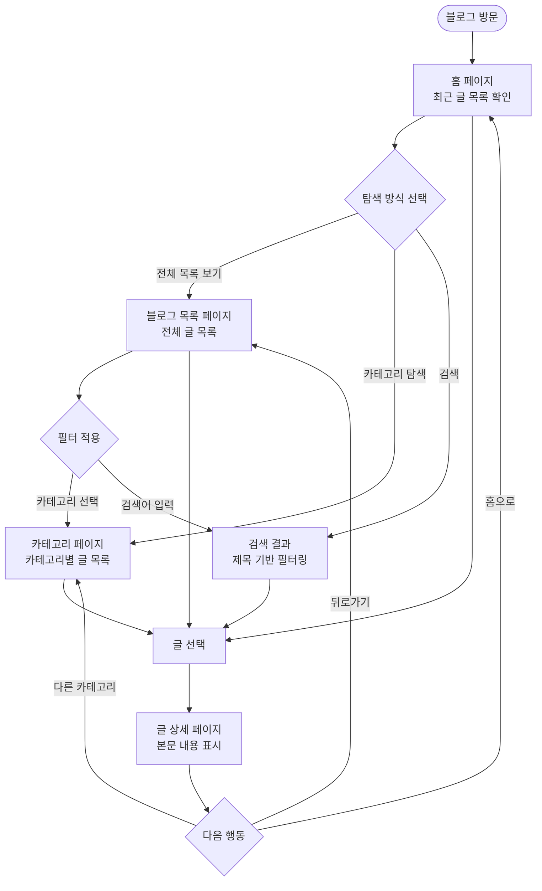

# PRD: 개인 개발 블로그 (Notion CMS 기반)

---

## 섹션 1: 핵심 정보

| 항목 | 내용 |
|------|------|
| **프로젝트명** | 개인 개발 블로그 |
| **버전** | v1.0.0 (MVP) |
| **작성일** | 2026-03-10 |
| **목적** | Notion을 CMS로 활용하여, Notion에서 글을 작성하면 자동으로 블로그에 반영되는 개인 기술 블로그 운영 |
| **대상 사용자** | 기술 블로그를 방문하는 개발자 및 IT 관심자, 블로그 운영자(본인) |

### 성공 지표

| 지표 | 목표값 | 측정 방법 |
|------|--------|-----------|
| Notion 글 발행 후 블로그 반영 시간 | 60초 이내 (ISR 주기) | 수동 측정 |
| 글 상세 페이지 로드 속도 (LCP) | 2.5초 이하 | Google PageSpeed Insights |
| 모바일 반응형 적합성 점수 | 90점 이상 | Google PageSpeed (Mobile) |
| SEO 메타데이터 적용률 | 글 목록 + 상세 페이지 100% | 수동 확인 |
| MVP 구현 완료 기능 수 | F001~F005 + F007 + F008 (7개) | 기능 명세 체크리스트 |

---

## 섹션 2: 사용자 여정

### 방문자 탐색 플로우



---

## 섹션 3: 기능 명세

| 기능 ID | 기능명 | MVP 필수 여부 | 우선순위 | 관련 페이지 |
|---------|--------|:-------------:|----------|------------|
| **F001** | 글 목록 조회 (Status=발행됨 필터) | ✅ MVP 필수 | High | 홈 페이지, 블로그 목록 페이지 |
| **F002** | 글 상세 조회 (Blocks API 본문 렌더링) | ✅ MVP 필수 | High | 글 상세 페이지 |
| **F003** | 카테고리별 필터링 | ✅ MVP 필수 | High | 카테고리 페이지, 블로그 목록 페이지 |
| **F004** | 검색 기능 (제목 기반) | 🔄 MVP 이후 | Medium | 블로그 목록 페이지 |
| **F005** | 반응형 디자인 | ✅ MVP 필수 | High | 전체 페이지 |
| **F006** | 다크모드 지원 | ✅ MVP 필수 | Medium | 전체 페이지 |
| **F007** | ISR (증분 정적 재생성) 캐싱 | ✅ MVP 필수 | High | 홈 페이지, 블로그 목록 페이지, 글 상세 페이지 |
| **F008** | SEO 메타데이터 | ✅ MVP 필수 | High | 전체 페이지 |

### 기능 상세 설명

#### F001 — 글 목록 조회
- Notion 데이터베이스에서 `Status = 발행됨` 조건으로 필터링
- `Published` 날짜 기준 내림차순 정렬
- 표시 항목: 제목, 카테고리, 태그, 발행일
- 페이지당 최대 10개 항목 표시
- **[검증 반영 m-03]** API 응답의 `has_more: true` 시 `next_cursor`를 이용한 추가 조회 구현 필수 (API 기본 페이지네이션 적용)

#### F002 — 글 상세 조회
- **[검증 반영 M-01]** 페이지 본문 조회는 반드시 **2단계 API 호출**로 구현
  - 1단계: `GET /v1/pages/{page_id}` — 제목, 카테고리, 태그 등 속성(메타데이터)만 반환, 본문 미포함
  - 2단계: `GET /v1/blocks/{page_id}/children` — 본문 블록 별도 조회 필수
- **[검증 반영 M-02]** 중첩 블록(`has_children: true`) 은 해당 블록 ID로 동일 API를 **재귀 호출**하여 전체 본문 수집
- **[검증 반영 M-02]** 블록 페이지네이션 처리: `has_more: true` 시 `next_cursor`로 반복 조회
- 지원 블록 타입: `paragraph`, `heading_1/2/3`, `bulleted_list_item`, `numbered_list_item`, `code`, `image`, `quote`, `divider`
- 미지원 블록(`unsupported` 타입)은 플레인 텍스트로 폴백 처리

#### F003 — 카테고리별 필터링
- Notion `Category` (select 타입) 필드 기반 필터링
- URL 파라미터 또는 동적 라우트 세그먼트로 카테고리 구분
- 전체 카테고리 목록은 `GET /v1/databases/{database_id}` 스키마 조회로 select 옵션 목록 동적 수집
- **[검증 반영 m-03]** 카테고리별 글 목록 조회 시도 `has_more`/`next_cursor` 페이지네이션 처리 필수

#### F004 — 검색 기능
- 클라이언트 사이드에서 `Title` 필드 기준 문자열 포함 검색
- 검색어 입력 시 실시간 필터링 (debounce 300ms 적용)
- 결과 없음 상태 UI 표시
- **[검증 반영 m-01]** 클라이언트 검색은 **현재 로드된 데이터 범위 내**에서만 동작 (페이지네이션 미적용 시 문제없음)
  - MVP: 전체 글 목록을 한 번에 로드(`page_size: 100`)하여 클라이언트 검색 범위 확보
  - 향후 확장 시 서버 사이드 DB 필터 검색으로 전환 검토

#### F005 — 반응형 디자인
- 모바일(375px~), 태블릿(768px~), 데스크탑(1280px~) 3단계 브레이크포인트
- Tailwind CSS v4 반응형 유틸리티 활용
- 모바일에서는 1열, 태블릿 이상에서는 2열 카드 그리드

#### F006 — 다크모드 지원
- `next-themes` 기반 시스템 설정 연동 및 수동 전환
- 기존 `ThemeToggle` 컴포넌트 재사용

#### F007 — ISR 캐싱
- Next.js `revalidate` 옵션으로 60초 주기 ISR 적용
- Notion 글 수정 후 최대 60초 내 블로그에 반영
- **[검증 반영 m-02]** 모든 Notion API 호출에 Rate Limit 재시도 로직 필수 구현
  - Notion API 제한: 초당 평균 3개 요청
  - HTTP 429 응답 수신 시 `Retry-After` 헤더 값만큼 대기 후 재시도 (최대 3회)
  - 게시글 수 증가 시 동시 ISR 재생성으로 인한 Rate Limit 초과 가능성 주의

#### F008 — SEO 메타데이터
- Next.js `generateMetadata` 함수 활용
- 글 상세 페이지: `title`, `description` (글 첫 단락), `og:image`
- 목록 페이지: 페이지별 title, description 정적 정의
- **[검증 반영 M-03]** `og:image`에 Notion 내부 이미지 URL 직접 사용 금지
  - Notion 내부 이미지 URL은 `expiry_time` 만료 시 SNS 공유 시 이미지 깨짐 발생
  - **권장안 A (기본)**: Notion DB 커버 이미지를 외부 URL(GitHub raw, Cloudinary, Unsplash 등)로 설정 → 만료 없음
  - **권장안 B (대안)**: `/api/og?pageId={id}` 동적 OG 이미지 라우트 구현 (Next.js `ImageResponse` 활용)
  - 내부 파일(`cover.type === "file"`)과 외부 URL(`cover.type === "external"`)을 코드에서 반드시 구분 처리

---

## 섹션 4: 메뉴 구조

```
블로그
├── 홈
│   └── 최근 글 목록 (최대 6개)
├── 블로그
│   ├── 전체 글 목록
│   ├── 카테고리 필터
│   └── 검색
├── 카테고리
│   ├── [카테고리명] 별 글 목록
│   └── 카테고리 목록 (내비게이션 내)
└── 글 상세
    ├── 본문 내용
    ├── 태그 목록
    └── 뒤로가기 (블로그 목록 또는 카테고리)
```

### 내비게이션 구성

| 위치 | 항목 |
|------|------|
| 헤더 (데스크탑) | 홈, 블로그, 카테고리 |
| 헤더 (모바일) | 햄버거 메뉴 → Sheet 드로어 (Sidebar 재사용) |
| 푸터 | 저작권 정보, 기술 스택 링크 |

---

## 섹션 5: 페이지별 상세 기능

### 5.1 홈 페이지

| 항목 | 내용 |
|------|------|
| **역할** | 블로그 대문 역할. 블로그 소개와 최근 발행된 글을 최대 6개 노출하여 방문자의 첫인상 형성 |
| **진입 조건** | 도메인 루트(`/blog` 또는 `/`) 직접 접근 또는 헤더 '홈' 링크 클릭 |
| **사용자 행동** | 최근 글 카드 클릭 → 글 상세 이동, '전체 글 보기' 버튼 → 블로그 목록 이동 |

**기능 목록:**
- 최근 발행된 글 카드 목록 표시 (제목, 카테고리 badge, 발행일, 요약 첫 줄)
- '전체 글 보기' CTA 버튼
- 블로그 소개 헤더 텍스트
- 다크모드 전환 버튼 (헤더 내)

**구현 기능 ID:** F001, F005, F006, F007, F008

---

### 5.2 블로그 목록 페이지

| 항목 | 내용 |
|------|------|
| **역할** | 발행된 전체 글을 탐색하는 허브 페이지. 카테고리 필터와 검색 기능 제공 |
| **진입 조건** | 헤더 '블로그' 클릭, 홈 '전체 글 보기' 클릭, 카테고리 선택 후 전체 초기화 |
| **사용자 행동** | 카테고리 탭 선택으로 필터링, 검색어 입력으로 제목 검색, 글 카드 클릭 → 상세 이동 |

**기능 목록:**
- 전체 발행 글 목록 카드 그리드 (2열, 모바일 1열)
- 카테고리별 필터 탭 (전체 + 카테고리 목록)
- 제목 기반 검색 입력창 (debounce 처리)
- 글 카드 컴포넌트: 제목, 카테고리 badge, 태그 badge 목록, 발행일
- 결과 없음 빈 상태 UI

**구현 기능 ID:** F001, F003, F004, F005, F006, F007, F008

---

### 5.3 글 상세 페이지

| 항목 | 내용 |
|------|------|
| **역할** | 개별 블로그 글의 전체 본문을 렌더링하여 표시하는 페이지 |
| **진입 조건** | 블로그 목록 또는 홈의 글 카드 클릭, 카테고리 페이지 내 글 클릭, 직접 URL 접근 |
| **사용자 행동** | 본문 스크롤 읽기, 태그 클릭 → 카테고리 필터, 뒤로가기 → 목록 복귀 |

**기능 목록:**
- 글 제목, 카테고리, 태그, 발행일 헤더 영역
- Notion Blocks API 기반 본문 렌더링 (Heading, Paragraph, Code, Image, List, Quote, Divider)
- 코드 블록 신택스 하이라이팅 (언어 표시)
- 뒤로가기 버튼 (블로그 목록으로)
- 글 없음/오류 시 fallback UI (404 처리)

**구현 기능 ID:** F002, F005, F006, F007, F008

---

### 5.4 카테고리 페이지

| 항목 | 내용 |
|------|------|
| **역할** | 특정 카테고리에 속한 글만 모아서 보여주는 필터링 전용 페이지 |
| **진입 조건** | 블로그 목록 카테고리 탭 클릭, 글 상세 페이지 카테고리 badge 클릭, 헤더 '카테고리' 메뉴 → 특정 카테고리 선택 |
| **사용자 행동** | 해당 카테고리 글 카드 목록 탐색, 글 카드 클릭 → 상세 이동, 다른 카테고리 탭 선택 |

**기능 목록:**
- 선택된 카테고리명 헤더 표시
- 해당 카테고리 글 카드 그리드 목록
- 전체 카테고리 목록 사이드 내비게이션 또는 탭
- 글 없음 빈 상태 UI (해당 카테고리에 발행된 글이 없을 때)

**구현 기능 ID:** F001, F003, F005, F006, F007, F008

---

## 섹션 6: 데이터 모델

### Notion 데이터베이스 필드 정의

| 필드명 | Notion 타입 | 설명 | 비고 |
|--------|------------|------|------|
| `Title` | `title` | 글 제목 | 필수 |
| `Category` | `select` | 카테고리 (예: JavaScript, TypeScript, DevOps) | 필수 |
| `Tags` | `multi_select` | 태그 복수 선택 | 선택 |
| `Published` | `date` | 발행일 | 필수 |
| `Status` | `select` | 글 상태 — `초안` / `발행됨` | 필수, 발행됨만 노출 |
| `Content` | (page content) | 페이지 블록으로 구성된 본문 | Blocks API로 별도 조회 |
| `Slug` | `rich_text` | URL 친화적 슬러그 (예: `nextjs-ssr-guide`) | **[검증 반영 m-04]** 추가 권장 — 미설정 시 제목 kebab-case 변환으로 폴백 |

### TypeScript 타입 정의

```typescript
/** Notion 데이터베이스에서 가져온 블로그 글 타입 */
export interface BlogPost {
  /** Notion 페이지 고유 ID */
  id: string;
  /** 글 제목 */
  title: string;
  /** 카테고리 (단일 선택) */
  category: string;
  /** 태그 목록 (복수 선택) */
  tags: string[];
  /** 발행일 (ISO 8601 문자열) */
  publishedAt: string;
  /** 글 상태 */
  status: "초안" | "발행됨";
  /** 슬러그 (URL용 — Notion DB의 Slug 필드 우선, 없으면 제목 kebab-case 변환) */
  slug: string;
}

/** Notion Block 렌더링 타입 */
export interface NotionBlock {
  id: string;
  type:
    | "paragraph"
    | "heading_1"
    | "heading_2"
    | "heading_3"
    | "bulleted_list_item"
    | "numbered_list_item"
    | "code"
    | "image"
    | "quote"
    | "divider";
  /** 블록 타입별 콘텐츠 */
  content: NotionRichText[] | NotionCodeBlock | NotionImageBlock | null;
}

/** Notion Rich Text 타입 */
export interface NotionRichText {
  plainText: string;
  href: string | null;
  annotations: {
    bold: boolean;
    italic: boolean;
    strikethrough: boolean;
    underline: boolean;
    code: boolean;
  };
}

/** 코드 블록 타입 */
export interface NotionCodeBlock {
  language: string;
  richText: NotionRichText[];
}

/** 이미지 블록 타입 */
export interface NotionImageBlock {
  type: "external" | "file";
  url: string;
  caption: NotionRichText[];
}
```

### Notion API 응답 → 앱 타입 변환 예시

```typescript
import { Client } from "@notionhq/client";
import type { PageObjectResponse } from "@notionhq/client/build/src/api-endpoints";
import type { BlogPost } from "@/types/blog";

/**
 * Notion 페이지 응답 객체를 BlogPost 타입으로 변환
 * @param page - Notion API에서 반환된 PageObjectResponse
 * @returns 앱에서 사용할 BlogPost 객체
 */
export function mapPageToBlogPost(page: PageObjectResponse): BlogPost {
  const props = page.properties;

  // Title 속성 추출
  const titleProp = props["Title"];
  const title =
    titleProp.type === "title"
      ? titleProp.title.map((t) => t.plain_text).join("")
      : "";

  // Category 속성 추출
  const categoryProp = props["Category"];
  const category =
    categoryProp.type === "select" ? (categoryProp.select?.name ?? "") : "";

  // Tags 속성 추출
  const tagsProp = props["Tags"];
  const tags =
    tagsProp.type === "multi_select"
      ? tagsProp.multi_select.map((t) => t.name)
      : [];

  // Published 날짜 추출
  const publishedProp = props["Published"];
  const publishedAt =
    publishedProp.type === "date"
      ? (publishedProp.date?.start ?? "")
      : "";

  // Status 속성 추출
  const statusProp = props["Status"];
  const status =
    statusProp.type === "select"
      ? ((statusProp.select?.name ?? "초안") as "초안" | "발행됨")
      : "초안";

  return {
    id: page.id,
    title,
    category,
    tags,
    publishedAt,
    status,
    slug: page.id, // 기본값: 페이지 ID 사용 (추후 커스텀 슬러그 필드 추가 가능)
  };
}
```

---

## 섹션 7: 기술 스택 및 설정

### 기술 스택 전체 목록

| 분류 | 라이브러리 / 도구 | 버전 | 용도 |
|------|-----------------|------|------|
| Frontend | Next.js | 16.1.6 | App Router 기반 SSR/ISR 프레임워크 |
| Language | TypeScript | ^5 | 타입 안전성 |
| CMS | @notionhq/client | 최신 | Notion API 공식 클라이언트 |
| Styling | Tailwind CSS | ^4 | 유틸리티 퍼스트 CSS |
| UI 컴포넌트 | shadcn/ui | ^4.0.2 | 재사용 가능 UI 컴포넌트 |
| 아이콘 | lucide-react | ^0.577.0 | SVG 아이콘 |
| 다크모드 | next-themes | ^0.4.6 | 테마 관리 |
| 폼 | react-hook-form | ^7.71.2 | 폼 상태 관리 |
| 유효성 검사 | zod | ^4.3.6 | 스키마 기반 검증 |
| 날짜 | date-fns | ^4.1.0 | 날짜 포맷팅 |
| 토스트 | sonner | ^2.0.7 | 알림 UI |
| 배포 | Vercel | - | CI/CD 및 호스팅 |

### 개발 착수 전 필수 체크리스트 (검증 반영)

> 검증 보고서(`PRD-validation.md`) 결과를 반영한 착수 전 확인 항목입니다.

| # | 항목 | 근거 이슈 | 완료 |
|---|------|-----------|------|
| 1 | `npm install @notionhq/client` 실행 | — | ☐ |
| 2 | Notion DB에 `Slug` (rich_text) 속성 추가 | m-04 | ☐ |
| 3 | `.env.example`에 `NOTION_API_KEY`, `NOTION_DATABASE_ID` 추가 | — | ☐ |
| 4 | Notion DB 커버 이미지를 **외부 URL**로 설정하는 운영 정책 수립 | M-03 | ☐ |
| 5 | `withRetry()` Rate Limit 재시도 래퍼 함수 구현 (모든 API 호출에 적용) | m-02 | ☐ |
| 6 | F002 구현 시 페이지 조회 → 블록 조회 **2단계 분리** 확인 | M-01 | ☐ |

---

### 신규 설치 필요 패키지

```bash
# Notion API 공식 클라이언트 (필수)
npm install @notionhq/client

# Notion 블록 → Markdown 변환 (선택 사항, 본문 렌더링 보조)
npm install notion-to-md
```

> **주의:** `@notionhq/client`는 현재 `package.json`에 미설치 상태입니다. 블로그 기능 구현 전 반드시 설치해야 합니다.

### 환경 변수 설정

`.env.local` 파일에 아래 변수를 추가합니다. (`.env.example`만 수정 후 `.env.local`은 별도 생성)

```bash
# .env.example
# Notion API 설정
NOTION_API_KEY=your_notion_integration_api_key
NOTION_DATABASE_ID=your_notion_database_id
```

**환경 변수 획득 방법:**

1. `NOTION_API_KEY`: [https://www.notion.so/my-integrations](https://www.notion.so/my-integrations) → 새 통합 생성 → 내부 통합 시크릿 복사
2. `NOTION_DATABASE_ID`: Notion 데이터베이스 페이지 URL에서 추출
   - URL 형식: `https://www.notion.so/{workspace}/{DATABASE_ID}?v=...`
   - 32자리 UUID에서 하이픈 제거 또는 그대로 사용 가능

### Notion API 클라이언트 초기화

```typescript
// lib/notion.ts
import { Client } from "@notionhq/client";

/** Notion API 클라이언트 싱글톤 인스턴스 */
export const notionClient = new Client({
  auth: process.env.NOTION_API_KEY,
});

/** 환경 변수에서 Notion 데이터베이스 ID 가져오기 */
export const NOTION_DATABASE_ID = process.env.NOTION_DATABASE_ID ?? "";
```

### ISR 설정 예시

```typescript
// app/(blog)/blog/page.tsx (Server Component)
import { notionClient, NOTION_DATABASE_ID } from "@/lib/notion";

/** ISR: 60초마다 재검증 */
export const revalidate = 60;

export default async function BlogListPage() {
  // Notion API 호출
  const response = await notionClient.databases.query({
    database_id: NOTION_DATABASE_ID,
    filter: {
      property: "Status",
      select: { equals: "발행됨" },
    },
    sorts: [{ property: "Published", direction: "descending" }],
  });
  // ...
}
```

### 기존 설치된 shadcn/ui 컴포넌트 (18개)

블로그 UI 구현 시 아래 컴포넌트를 바로 사용할 수 있습니다.

| 컴포넌트 | 블로그 활용 용도 |
|---------|----------------|
| `badge` | 카테고리, 태그 표시 |
| `button` | CTA, 뒤로가기 버튼 |
| `card` | 글 목록 카드 컴포넌트 |
| `input` | 검색 입력창 |
| `skeleton` | 로딩 상태 플레이스홀더 |
| `separator` | 글 본문 구분선 (divider 블록) |
| `scroll-area` | 긴 본문 스크롤 영역 |
| `tooltip` | 태그 설명 툴팁 |
| `breadcrumb` | 글 상세 페이지 경로 표시 |
| `sheet` | 모바일 내비게이션 드로어 |

---

## 정합성 검증 결과

### 검증 1: 섹션 3 기능 ID → 섹션 5 참조 여부

| 기능 ID | 기능명 | 섹션 5 참조 페이지 | 상태 |
|---------|--------|-----------------|------|
| F001 | 글 목록 조회 | 홈(5.1), 블로그 목록(5.2), 카테고리(5.4) | ✅ |
| F002 | 글 상세 조회 | 글 상세(5.3) | ✅ |
| F003 | 카테고리별 필터링 | 블로그 목록(5.2), 카테고리(5.4) | ✅ |
| F004 | 검색 기능 | 블로그 목록(5.2) | ✅ |
| F005 | 반응형 디자인 | 홈(5.1), 블로그 목록(5.2), 글 상세(5.3), 카테고리(5.4) | ✅ |
| F006 | 다크모드 지원 | 홈(5.1), 블로그 목록(5.2), 글 상세(5.3), 카테고리(5.4) | ✅ |
| F007 | ISR 캐싱 | 홈(5.1), 블로그 목록(5.2), 글 상세(5.3), 카테고리(5.4) | ✅ |
| F008 | SEO 메타데이터 | 홈(5.1), 블로그 목록(5.2), 글 상세(5.3), 카테고리(5.4) | ✅ |

**결과: 모든 기능 ID(F001~F008)가 섹션 5에 참조됨** ✅

---

### 검증 2: 섹션 4 메뉴 구조 → 섹션 5 페이지 존재 여부

| 섹션 4 메뉴 항목 | 섹션 5 대응 페이지 | 상태 |
|----------------|-----------------|------|
| 홈 | 5.1 홈 페이지 | ✅ |
| 블로그 (전체 글 목록) | 5.2 블로그 목록 페이지 | ✅ |
| 카테고리 ([카테고리명] 별 목록) | 5.4 카테고리 페이지 | ✅ |
| 글 상세 | 5.3 글 상세 페이지 | ✅ |

**결과: 섹션 4의 모든 페이지가 섹션 5에 존재함** ✅

---

### 검증 3: 섹션 6 데이터 모델 → 섹션 3 기능 명세 일치 여부

| 데이터 모델 필드 | 관련 기능 ID | 일치 여부 |
|----------------|------------|---------|
| `Title` (제목) | F001 (목록), F004 (검색 기준), F008 (SEO 제목) | ✅ |
| `Category` (카테고리) | F001 (목록 표시), F003 (카테고리 필터링) | ✅ |
| `Tags` (태그) | F001 (목록 표시), F002 (상세 표시) | ✅ |
| `Published` (발행일) | F001 (정렬 기준), F008 (SEO 메타) | ✅ |
| `Status` (초안/발행됨) | F001 (발행됨 필터 조건) | ✅ |
| `Content` (본문) | F002 (Blocks API 렌더링), F008 (description 추출) | ✅ |

**결과: 섹션 6 데이터 모델이 섹션 3 기능 명세와 완전히 일치함** ✅

---

### 종합 검증 결과

| 검증 항목 | 결과 |
|----------|------|
| 기능 ID 참조 완전성 (F001~F008) | ✅ 통과 |
| 메뉴 구조 ↔ 페이지 명세 일치 | ✅ 통과 |
| 데이터 모델 ↔ 기능 명세 일치 | ✅ 통과 |

**모든 정합성 검증 항목을 통과했습니다.**

---

### PRD-validation.md 이슈 반영 현황

> `docs/PRD-validation.md` 기술 검증 보고서의 이슈를 반영한 PRD 수정 내역입니다.

| 이슈 ID | 등급 | 관련 기능 | 반영 위치 | 반영 내용 요약 |
|---------|------|-----------|-----------|--------------|
| M-01 | Major | F002 | 섹션 3 F002 상세 | 2단계 API 호출 구조 명시 (pages API + blocks API 분리) |
| M-02 | Major | F002 | 섹션 3 F002 상세 | 중첩 블록 재귀 처리 및 블록 페이지네이션 구현 요구사항 추가 |
| M-03 | Major | F008 | 섹션 3 F008 상세 | Notion 내부 이미지 URL 직접 사용 금지, 외부 URL 정책/동적 OG 라우트 대안 명시 |
| m-01 | Minor | F004 | 섹션 3 F004 상세 | 클라이언트 검색 범위 제한 명시, MVP는 전체 로드(`page_size: 100`) 전략 추가 |
| m-02 | Minor | F007 | 섹션 3 F007 상세 | Rate Limit(초당 3회) 재시도 로직 구현 필수 명시 |
| m-03 | Minor | F001, F003 | 섹션 3 F001·F003 상세 | `has_more`/`next_cursor` 페이지네이션 처리 구현 명시 |
| m-04 | Minor | 전반 | 섹션 6 DB 필드, 섹션 7 체크리스트 | Notion DB에 `Slug` (rich_text) 필드 추가, 슬러그 생성 로직 명시 |
